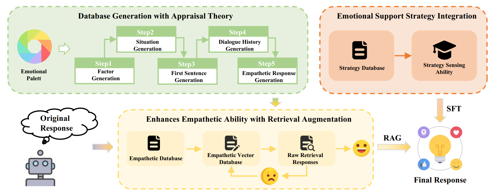
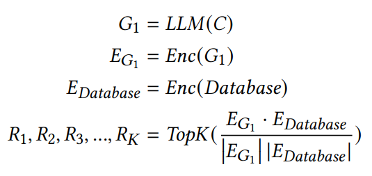
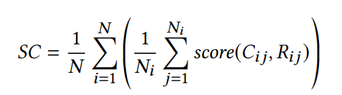

# APTNESS
APTNESS: Incorporating Appraisal Theory and Emotion Support Strategies for Empathetic Response Generation

## Usage

### Train
The library we used for training our model is Llama-factory. (https://github.com/hiyouga/LLaMA-Factory)

### Evaluation
```
bash evaluate_example.sh
```

## Method

### APTNESS Framework

The **APTNESS** framework consists of three parts: the generation of a empathetic response database with empathetic response appraisal theory, the retrieval augmentation module, and the integration of emotional support strategies module.




### The APT Database

We introduce an empathetic emotional palette and use appraisal theory to decompose emotions, thereby generating a comprehensive empathetic response database. The generate procedure is a step-by-step manner: 
Generate the first utterance of an empathetic dialogue; 
Continue the dialogue to generate the whole empathetic dialogue; 
Rethink the emotion, the factor, and the situation of the dialogue, and then regenerate the last turn of the listener with an empathetic response.

#### Empathetic Responses Retrieval

First, generate an initial response using the large language model, and then retrieve the top-k relevant responses from the constructed empathetic database based on similarity.



#### Emotional Support Strategy Integration

Fine-tune the LoRA module integrated with emotional support strategies to introduce more conversational skills into LLMs, helping to improve their empathetic abilities in all aspects.


### Evaluation Framework

#### Evaluation Metrics

* The main evaluation metric
  
Empathy: Assess how well the response understands and appropriately expresses recognition of the Speaker's feelings and experiences.

* Submetrics
  
Coherence: Evaluate the relevance and logical connection of the response to the dialogue context.
Informativity: Determine the richness and value of the information provided in the response.
Identification: Rate the depth at which the response delves into the Speaker's situation and effectively identifies their problems.
Comforting: Score the proficiency of the response in providing comfort and support.
Suggestion: Rate the quality of the suggestions offered for addressing the Speaker's issues.

#### Turn-Based Dialogue Evaluation

In this work, we adopt turn-based empathetic response evaluation. Specifically, for each dialogue $C_i$ with $N_i$ turns, we use all conversation history till the $j$-th turn plus the query from the Speaker, denoted as $C_{ij}$, together with the generated the response $R_{ij}$ from LLMs. 
When scoring, GPT-4 assigns a score based on a dialogue history $C_{ij}$ and its response $R_{ij}$.
The scoring process is denoted as a function $\textit{score}$. 
Then we average all scores obtained for a complete dialogue as the score of an whole dialogue. 
Finally, we average all dialogues' scores as the final score $SC$, the equations are shown as follows:



## Citation

If you find our work helpful in your research, please cite the following paper:

## Acknowledgement

This repo benefits from [Llama-factory](https://github.com/hiyouga/LLaMA-Factory).

